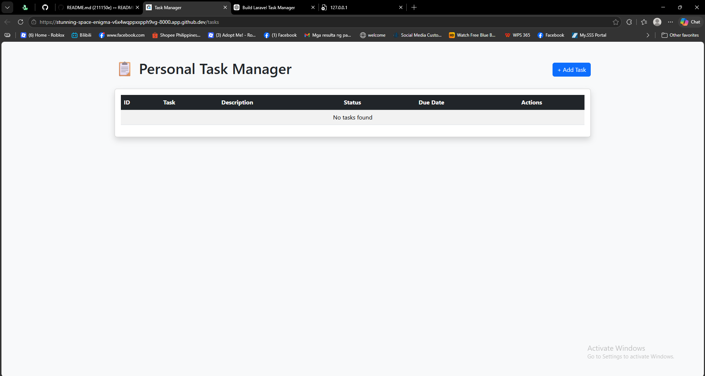
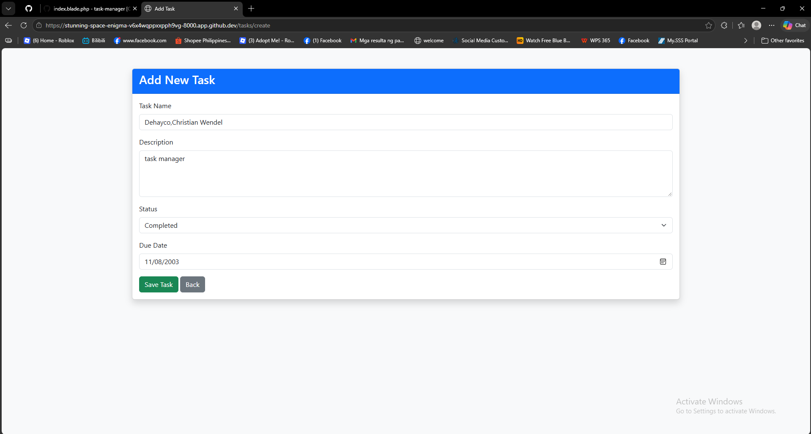
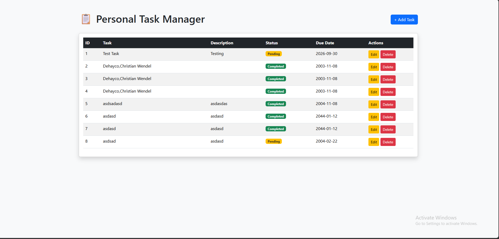

# Laravel Mini Project: Personal Task Manager

## Project Information

- **Project Code:** WST21-PM-2026-SF
- **Student Name:** DEHAYCO, CHRISTIAN WENDEL DEHAYCO
- **Course & Year:** BSIT 2
- **Database Used:** SQLite

## Features

- Add Task
- View Tasks
- Edit Task
- Delete Task
- Update Status

---

## Screenshots

### Task List



### Add Task



### Saved Task



---

## How to Run

```bash
composer install
php artisan migrate
php artisan serve
```

Open your browser and visit:

```text
http://127.0.0.1:8000/tasks
```

## Technologies Used

- Laravel 12
- PHP
- SQLite
- Bootstrap 5
- GitHub